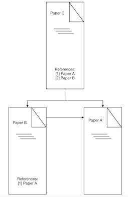
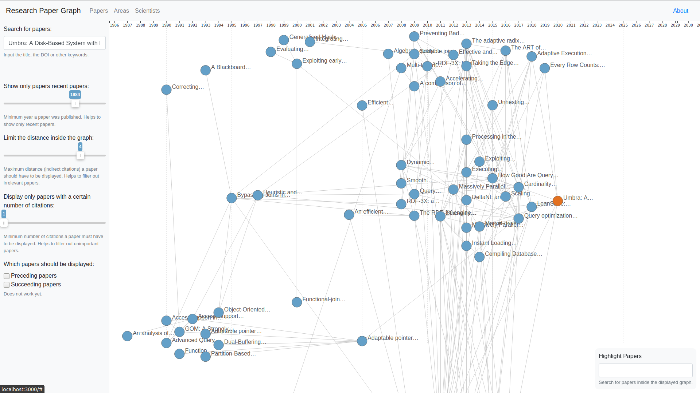

# Research Paper Graph
The Research Paper Analyser examines to what extent research work is related to each other, 
i.e. whether and how often it refers to each other. 
For example, if paper C is based on papers A and B and paper B is based on paper A, then papers A, B and C are connected. 



## Build Status
[](https://github.com/Jibbow/research-paper-graph/actions?query=workflow%3A%22CI+Pipeline+Backend%22)
[](https://github.com/Jibbow/research-paper-graph/actions?query=workflow%3A%22CI+Pipeline+Frontend%22)

A limited (and sometimes broken) demo can be found on [https://research-paper-graph-frontend.herokuapp.com/](https://research-paper-graph-frontend.herokuapp.com/).

## Motivation
When we read a paper for our research and are interested in further work on our topic, 
going through all cited papers to find out which one is important can be a tedious exercise. In our project, we want to facilitate the process by providing a citation graph which will easily give the opportunity to see which papers are similar and hence close to our paper and which are generally most important to the topic by identifying the most central papers in the topic cluster in the graph.

Sometimes we don't come across a special paper, but a whole field of research that interests us. 
On the one hand, we will ask ourselves which papers are relevant for the respective research area. 
On the other hand, we want to know into which topics our field can be subdivided.  
We therefore need an instrument that assigns families of research work to their research topic and their field of research.

When our government discusses a problem, it often involves external professors and asks them for advice. 
We want to make sure that our government has the best information in order to decide which experts to invite concerning a special topic by seeing how central the professor's papers are within the field of interest. The same holds for universities calling a professor to a chair. Our graph provides multiple additional information which can support their decision making. It also helps to easily identify members of the appointment commission, which have been publishing with a candidate and which are therefore biased. 

## Screenshot


## Technologies
- As our database we use PostgreSQL.
- We implement our scraper in Python and let it access the SemanticScholar Paper API.
- We build our backend on Flask using Python.
- We write our frontend in Typescript and React, integrating frameworks for graph visualization.

### PostgreSQL
PostgreSQL is a free, open source object-relational database management system. 
It supports SQL language, extensible data types, operators, functions and aggregates as well as the ACID conditions.
Reliability, robustness, and performance characterize PostgreSQL.
Link: [https://www.postgresql.org](https://www.postgresql.org)

### Python
Python is a universal, interpreted, and higher programming language. 
Because it is both concise and readable, we can easily learn and understand Python. 
Data is particularly well analysed with Python.
Link: [https://www.python.org](https://www.python.org) 

### SemanticScholar Paper API
SemanticScholar stores metainformation about papers, their authors, and their references. 
We can download this information and access it through an API.
Link: [https://api.semanticscholar.org](https://api.semanticscholar.org) 

### Flask
Flask is a Web Application Framework in Python. 
We use Flask to develop the components of our web application because it helps us integrate existing libraries into our software.
Extensibility and good documentation characterize Flask. 
Link: [https://www.palletsprojects.com/p/flask/](https://www.palletsprojects.com/p/flask/)

### TypeScript
TypeScript is a superset of JavaScript, i.e. it extends JavaScript by features such as, 
in particular, the optional static typing at the time of compilation. 
This allows us to , for example, structurally type, infer types, and parameterize types. 
Link: [https://www.typescriptlang.org](https://www.typescriptlang.org)

### React
React is a JavaScript-based web framework, i.e. it acts as a basic framework for the output of UI components on websites. 
In React, we build components hierarchically and represent them as self-defined HTML tags. 
React is designed for simplicity, performance, and reusability. 
Link: [https://reactjs.org](https://reactjs.org)

### D3.js
D3.js (Data Driven Documents) is a JavaScript-based library that allows you to represent structural information as a network in your browser.
D3.js is based on the web standards SVG, CSS, and HTML5, which makes D3.js not only fast even with large amounts of data, but also future-proof.
Link: [https://d3js.org](https://d3js.org)

## Installation
### How to run the Research Analyzer
#### Step 1: Install all prerequisites
1. Install Python.
2. Install pip.
3. Install npm or yarn.
4. Install PostgreSQL.
5. [Recommended] Install virtualenv.
6. [Recommended] If you are using IntelliJ, install the [PyLint Plugin](https://plugins.jetbrains.com/plugin/11084-pylint/).

#### Step 2: Initialize the database
1. Start PostgreSQL.

2. Create a database called research:
```
createdb research
```

3. Navigate to the backend directory: 
```
cd backend
```

4. Upgrade database migrations:
```
python app.py db upgrade
```

#### Step 3: Start the backend
1. Navigate to the backend directory: 
```
cd backend
```

2. [Recommended] Create virtualenv: 
```
virtualenv venv
```

3. [Recommended] Activate virtualenv:
```
source venv/bin/activate
```

4. Install Python dependencies
```
pip install -r requirements.txt
```

5. Run the app: 
```
python app.py run
```

6. Check the Swagger documentation in your browser: 
```
http://127.0.0.1:5000
```

#### Step 4: Scrape research papers
1. Navigate to the scraper directory:
```
cd backend/scraper
```

2. Run the scraper:
```
python __init__.py
```

#### Step 5: Start the frontend
1. Navigate to the frontend directory: 
```
cd frontend
```

2. Install required frontend dependencies: 
```
npm install
```
or 
```
yarn install
```

3. Run server file: 
```
npm start
```
or 
```
yarn start
```

4. Check the frontend in your browser: 
```
http://127.0.0.1:3000
```

### How to modify the Research Analyzer
#### Learn Flask
 - [The Flask mega tutorial](https://blog.miguelgrinberg.com/post/the-flask-mega-tutorial-part-i-hello-world)
 - [Flask Project Website](https://palletsprojects.com/p/flask/)

#### Learn TypeScript and React
 - [The TypeScript Handbook](https://www.typescriptlang.org/)
 - [TypeScript Example on React](https://www.typescriptlang.org/play/index.html?jsx=2&esModuleInterop=true&e=196#example/typescript-with-react)
 - [React + TypeScript Cheatsheets](https://github.com/typescript-cheatsheets/react-typescript-cheatsheet#reacttypescript-cheatsheets)
 - [React: Getting Started](https://reactjs.org/docs/getting-started.html)

#### Install new packages
When installing new packages, make sure that they appear in the `requirements.txt` file.
To update the `requirements.txt` file, run: 
```
pip freeze > requirements.txt
```

#### Test the backend
1. Navigate to the backend directory:
```
cd backend
```

2. Run all backend tests:
```
python app.py test
```

#### Lint
##### Backend
The backend uses `pylint`:
1. Navigate to the backend directory:
```
cd backend
```

2. Lint the app with pylint:
```
pylint app
```

2. Lint the scraper with pylint:
```
pylint scraper
```

##### Frontend
The project uses `tslint`:
1. Navigate to the frontend directory: 
```
cd frontend
```

2. Run tslint: 
```
npm run lint
```
or 
```
yarn run lint
```

#### Update database migrations
1. Create a new migration script from the model changes:
```
python app.py db migrate
```

2. Apply the migration script to the database:
```
python app.py db upgrade
```

## Contribute
If you want to contribute to the research-graph repository, please first read the Contributing Guidelines in the [Contributing](CONTRIBUTING.md) file.

## Credits
### How to structure a Flask-RESTPlus web service for production builds
The article 
[How to structure a Flask-RESTPlus web service for production builds](https://www.freecodecamp.org/news/structuring-a-flask-restplus-web-service-for-production-builds-c2ec676de563/) 
helped us to set up our backend using Python, Flask and Flask-SQLAlchemy.

### Flask Web Programming from Scratch
The article
[Flask Web Programming from Scratch](https://hackernoon.com/flask-web-programming-from-scratch-9ada8088fde1) 
showed us how to change our database from SQLite to PostgreSQL.

### Semantic Scholar API
The [Semantic Scholar API documentation](https://api.semanticscholar.org) demonstrated how we could
access paper and author information.

## License
This project is licensed under the MIT License - see the [LICENSE](./LICENSE) file for details.
